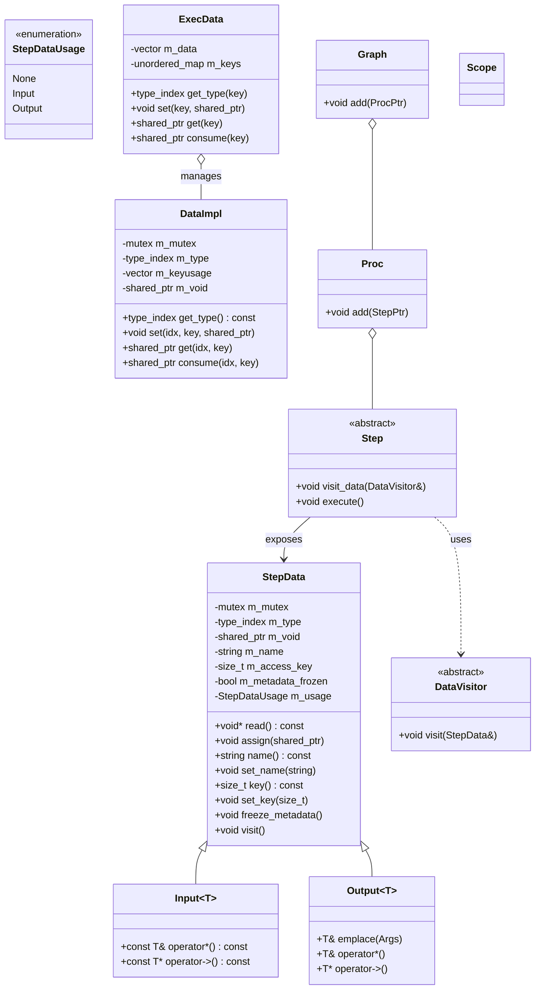

# Core Classes as of 2025‑06‑09

```mermaid
classDiagram
    direction TB

    class StepDataUsage {
        <<enumeration>>
        None
        Input
        Output
    }

    class StepData {
        +void* read() const
        +void assign(shared_ptr<void>)
        +string name() const
        +void set_name(string)
        +size_t key() const
        +void set_key(size_t)
        +void freeze_metadata()
        +void visit()
        -mutex m_mutex
        -type_index m_type
        -shared_ptr<void> m_void
        -string m_name
        -size_t m_access_key
        -bool m_metadata_frozen
        -StepDataUsage m_usage
    }

    class Input~T~ {
        +const T& operator*() const
        +const T* operator->() const
    }

    class Output~T~ {
        +T& emplace(Args)
        +T& operator*()
        +T* operator->()
    }

    StepData <|-- Input~T~
    StepData <|-- Output~T~

    class DataImpl {
        +type_index get_type() const
        +void set(idx, key, shared_ptr<void>)
        +shared_ptr<void> get(idx, key)
        +shared_ptr<void> consume(idx, key)
        -mutex m_mutex
        -type_index m_type
        -vector<KeyUsagePair> m_keyusage
        -shared_ptr<void> m_void
    }

    class ExecData {
        +type_index get_type(key)
        +void set(key, shared_ptr<void>)
        +shared_ptr<void> get(key)
        +shared_ptr<void> consume(key)
        -vector<DataImplPtr> m_data
        -unordered_map<AccessKey, KeyInfo> m_keys
    }

    ExecData o-- DataImpl : manages

    class DataVisitor {
        <<abstract>>
        +void visit(StepData&)
    }

    class Step {
        <<abstract>>
        +void visit_data(DataVisitor&)
        +void execute()
    }

    Step ..> DataVisitor : uses
    Step --> StepData : exposes

    class Proc {
        +void add(StepPtr)
    }
    Proc o-- Step

    class Graph {
        +void add(ProcPtr)
    }
    Graph o-- Proc

    class Scope {
    }
```
