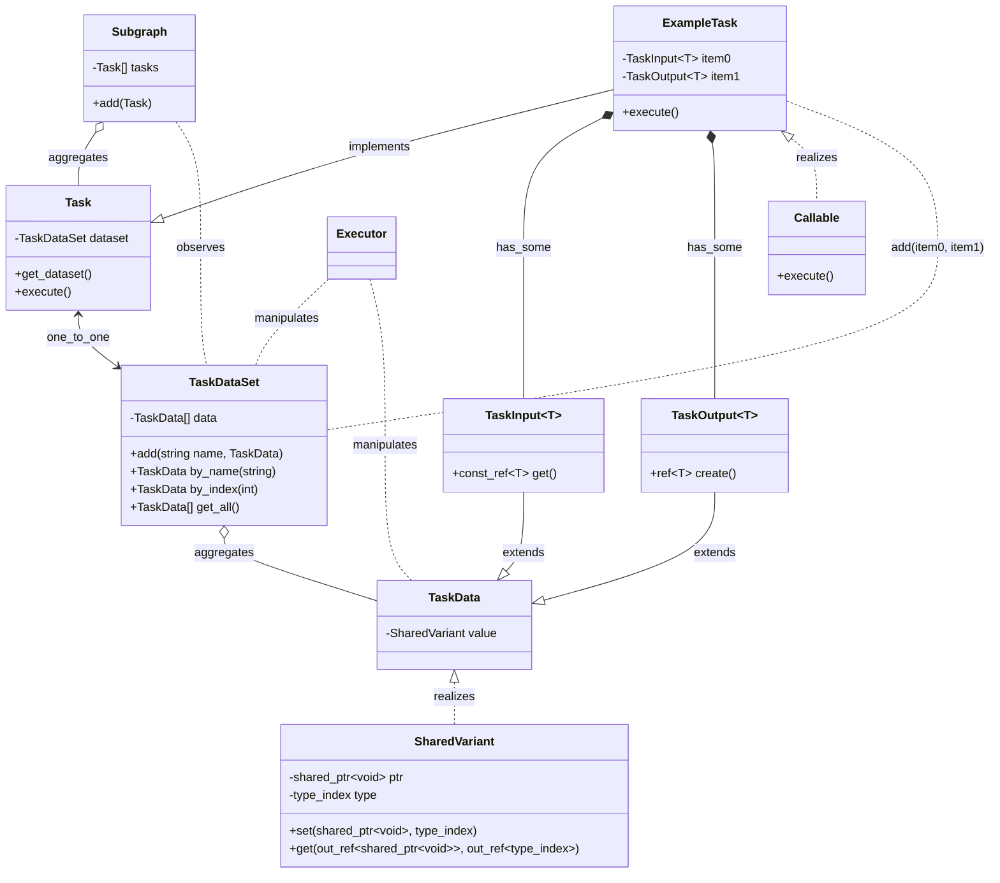

# Class diagram

Updated: 2025-05-30, 18:46pm

***This document must be kept up-to-date.***

## Class diagrams

```mermaid
classDiagram
Subgraph o-- Task : aggregates
Subgraph .. TaskDataSet : observes
Subgraph : -Task[] tasks
Subgraph : +add(Task)
ExampleTask --|> Task : implements
ExampleTask *-- TaskInput~T~ : has_some
ExampleTask *-- TaskOutput~T~ : has_some
ExampleTask <|.. Callable : realizes
ExampleTask : -TaskInput~T~ item0
ExampleTask : -TaskOutput~T~ item1
ExampleTask : +execute()
ExampleTask .. TaskDataSet : add(item0, item1)
Task <--> TaskDataSet : one_to_one
Task : +get_dataset()
Task : +execute()
Task : -TaskDataSet dataset
Executor .. TaskDataSet : manipulates
Executor .. TaskData : manipulates
TaskDataSet o-- TaskData : aggregates
TaskDataSet : +add(string name, TaskData)
TaskDataSet : +TaskData by_name(string)
TaskDataSet : +TaskData by_index(int)
TaskDataSet : +TaskData[] get_all()
TaskDataSet : -TaskData[] data
TaskData <|.. SharedVariant : realizes
TaskData : -SharedVariant value
TaskInput~T~ --|> TaskData : extends
TaskOutput~T~ --|> TaskData : extends
SharedVariant : -shared_ptr~void~ ptr
SharedVariant : -type_index type
SharedVariant : +set(shared_ptr~void~, type_index)
SharedVariant : +get(out_ref~shared_ptr~void~~, out_ref~type_index~)
TaskInput~T~ : +const_ref~T~ get()
TaskOutput~T~ : +ref~T~ create()
Callable : +execute()
```
